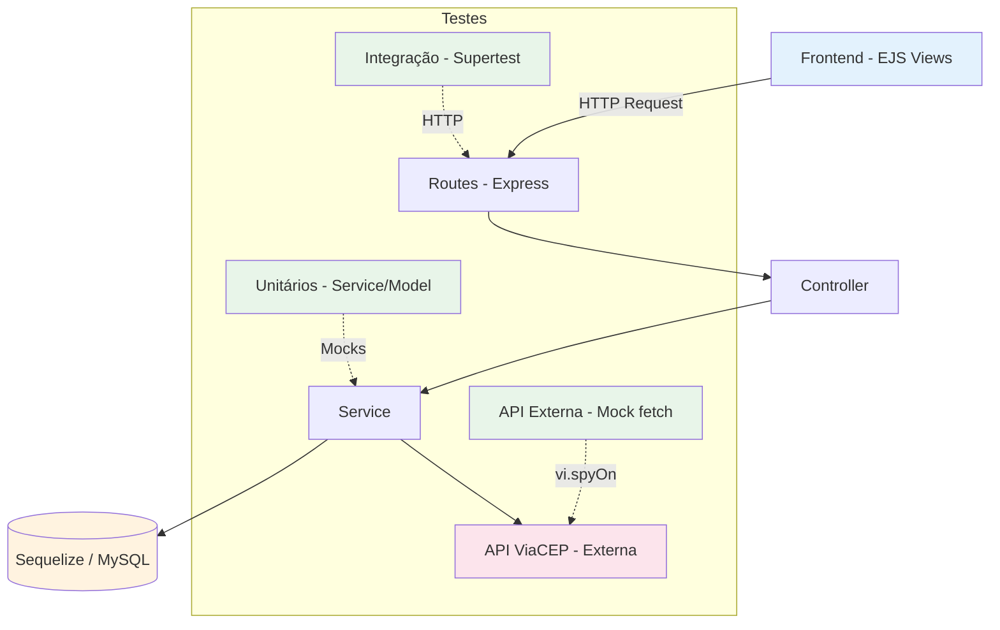

# Relatório de Desenvolvimento TDD — SkillUp

## 1. Funcionalidade Escolhida e Regras de Negócio

A funcionalidade escolhida para cobertura de testes foi a **Gestão de Usuários**, implementada nas camadas Service (`modules/user/userService.js`), Controller (`modules/user/userController.js`) e Model (`modules/user/User.js`). Adicionalmente, integramos o projeto com a **API pública do ViaCEP** para busca de endereços.

Regras de negócio garantidas:
- Não permitir que dois usuários possuam o mesmo e-mail (validação na criação).
- Atrelar dinamicamente cursos a um novo usuário usando relacionamentos N:N (`bulkCreate` na model `UserCourse`).
- Impedir que um administrador exclua sua própria conta.
- Impedir a atualização ou exclusão de um usuário inexistente.
- Hash de senhas com `bcryptjs` nos hooks `beforeCreate` e `beforeUpdate` do Sequelize.
- Validação e sanitização de CEP antes de consumir a API externa.
- Tratamento de falhas de rede e resiliência ao consumir APIs de terceiros.

---

## 2. Aplicação do TDD (Ciclo Red-Green-Refactor)

O desenvolvimento seguiu o ciclo **Red-Green-Refactor**:

1. **Red**: Declaramos o teste (ex: tentar excluir a própria conta) sem implementar a trava na Service. O teste falha.
2. **Green**: Adicionamos o código de validação na função `deleteUser` (ex: `if (editUser.id === currentUserId) throw new UserServiceError(...)`). O teste passa.
3. **Refactor**: Reavaliamos o código, otimizamos queries e mantemos a legibilidade, garantindo que o teste permaneça verde.

---

## 3. Exemplos de Testes Unitários (Nota 6 e 7)

### Exemplo 1: Validação de e-mail único
```javascript
it('deve lançar erro se o email já estiver cadastrado', async () => {
    User.findOne.mockResolvedValue({ id: 1, email: 'teste@teste.com' });
    await expect(userService.createUser({ email: 'teste@teste.com' }))
      .rejects.toThrow(UserServiceError);
    expect(User.findOne).toHaveBeenCalledTimes(1);
});
```
**Verifica**: A Service impede cadastro duplicado lançando exceção quando o e-mail já existe.

### Exemplo 2: Bloqueio de autoexclusão
```javascript
it('deve lançar erro se o usuário tentar deletar a própria conta', async () => {
    User.findByPk.mockResolvedValue({ id: 1 });
    await expect(userService.deleteUser(1, 1))
      .rejects.toThrow('Voce nao pode excluir sua propria conta.');
});
```
**Verifica**: A Service impede que um admin exclua seu próprio perfil.

### Exemplo 3: Criação em lote de relacionamentos
```javascript
it('deve criar um usuário e atrelar cursos usando bulkCreate', async () => {
    User.findOne.mockResolvedValue(null);
    User.create.mockResolvedValue({ id: 2, name: 'Maria' });
    await userService.createUser({ name: 'Maria' }, [1, 2]);
    expect(UserCourse.bulkCreate).toHaveBeenCalledWith([
      { userId: 2, courseId: 1 },
      { userId: 2, courseId: 2 }
    ]);
});
```
**Verifica**: O relacionamento N:N entre `User` e `Course` é criado corretamente via `bulkCreate`.

---

## 4. Testes de Integração com Supertest (Nota 8 e 9)

Utilizamos o **Supertest** para testar as rotas HTTP reais da aplicação, mockando apenas a camada de Service para isolar o comportamento do Controller.

### Exemplo: Criação de usuário via POST
```javascript
it('POST /admin/usuarios deve redirecionar (302) para lista após sucesso', async () => {
    userService.createUser.mockResolvedValue({ id: 2, name: 'Teste' });
    const res = await request(app)
      .post('/admin/usuarios')
      .send({ name: 'Teste', email: 'teste@teste.com' });
    expect(res.status).toBe(302);
    expect(res.headers.location).toBe('/admin/usuarios');
});
```

### Exemplo: Rota da API ViaCEP retornando JSON
```javascript
it('GET /profile/api/cep deve retornar JSON do endereço quando CEP é válido', async () => {
    userService.buscarDadosPorCep.mockResolvedValue({
      cep: '89231-630', localidade: 'Joinville', uf: 'SC'
    });
    const res = await request(app).get('/profile/api/cep?cep=89231630');
    expect(res.status).toBe(200);
    expect(res.body).toHaveProperty('localidade', 'Joinville');
});
```

**Total de testes de integração**: 15 (14 no `userController.test.js` + 1 no `health.test.js`).

---

## 5. Testes de API Externa — ViaCEP (Nota 9)

Para a Nota 9, integramos a aplicação com a **API pública do ViaCEP** (`https://viacep.com.br/ws/`). Os testes utilizam `vi.spyOn(global, 'fetch')` para interceptar as chamadas HTTP e simular os retornos sem depender de internet.

### 5.1 Cenários testados (12 testes no `viaCep.test.js`):

| # | Cenário | O que testa |
|---|---------|-------------|
| 1 | CEP válido retorna endereço | Mock retorna JSON completo do ViaCEP |
| 2 | Limpeza de caracteres do CEP | Hifens e pontos removidos antes do fetch |
| 3 | CEP inexistente (`{ erro: true }`) | Lança exceção `UserServiceError` |
| 4 | CEP com formato inválido | Lança erro sem chamar fetch |
| 5 | Servidor ViaCEP retorna HTTP 500 | Tratamento de `response.ok === false` |
| 6 | Falha de rede / timeout | `fetch` rejeita, Service captura e lança erro |
| 7 | Busca por texto com resultados | Retorna array com múltiplos endereços |
| 8 | Busca por texto sem resultados | Retorna array vazio `[]` |
| 9 | Busca com parâmetros faltando | Lança erro sem chamar fetch |
| 10 | Falha de rede na busca por texto | Service captura rejeição do fetch |
| 11 | Salvar dados complementares | `User.update()` chamado corretamente |
| 12 | Salvar para usuário inexistente | Lança `UserServiceError` |

### 5.2 Exemplo: Mock do fetch para simular rede offline
```javascript
it('deve lançar UserServiceError quando ocorre falha de rede / timeout', async () => {
    fetchSpy.mockRejectedValueOnce(new TypeError('Failed to fetch'));
    await expect(userService.buscarDadosPorCep('01001000'))
      .rejects.toThrow(UserServiceError);
});
```
**Verifica**: Quando a API do ViaCEP está fora do ar ou há um timeout, o sistema não crasha — ele lança um erro controlado que o frontend trata exibindo uma mensagem e liberando os campos para preenchimento manual.

---

## 6. Refatorações Realizadas (Nota 9)

### Refatoração 1: Tratamento de falha de rede no `fetch`

**Antes**: O `fetch` era chamado diretamente sem proteção contra rejeição de rede. Se a API do ViaCEP caísse, a aplicação inteira crashava com `UnhandledPromiseRejection`.
```javascript
// ANTES
const response = await fetch(`https://viacep.com.br/ws/${cleanCep}/json/`);
if (!response.ok) throw new UserServiceError('Erro na comunicação com ViaCEP.');
```

**Depois**: Envolvemos o `fetch` em um bloco `try/catch` dedicado, convertendo erros de rede nativos (`TypeError: Failed to fetch`) em `UserServiceError` controlados.
```javascript
// DEPOIS
let response;
try {
  response = await fetch(`https://viacep.com.br/ws/${cleanCep}/json/`);
} catch (e) {
  throw new UserServiceError('Erro na comunicação com ViaCEP.');
}
if (!response.ok) throw new UserServiceError('Erro na comunicação com ViaCEP.');
```
**Benefício**: Resiliência total — a aplicação nunca crasha. O frontend detecta o erro e libera os campos de endereço para preenchimento manual.

### Refatoração 2: Validação antecipada do CEP antes da chamada HTTP

**Antes**: A função `buscarDadosPorCep` enviava qualquer string direto para o ViaCEP, desperdiçando uma chamada de rede para inputs inválidos como `"abc"` ou `"123"`.
```javascript
// ANTES
async buscarDadosPorCep(cep) {
  const response = await fetch(`https://viacep.com.br/ws/${cep}/json/`);
  // ...
}
```

**Depois**: Adicionamos sanitização (`replace(/\D/g, '')`) e validação de comprimento (`length !== 8`) logo no início. CEPs inválidos geram erro instantaneamente, sem gastar banda de rede.
```javascript
// DEPOIS
async buscarDadosPorCep(cep) {
  const cleanCep = cep.replace(/\D/g, '');
  if (cleanCep.length !== 8) throw new UserServiceError('CEP inválido.');
  // só então faz o fetch...
}
```
**Benefício**: Economia de recursos e resposta imediata ao usuário sem latência de rede.

---

## 7. Diagrama de Arquitetura



---

## 8. Resumo de Testes

| Arquivo | Tipo | Qtd |
|---------|------|-----|
| `userService.test.js` | Unitário (Service) | 15 |
| `userModel.test.js` | Unitário (Model/Hooks) | 4 |
| `viaCep.test.js` | API Externa (Mock do fetch) | 12 |
| `userController.test.js` | Integração (Supertest) | 14 |
| `health.test.js` | Integração (Supertest) | 1 |
| **TOTAL** | | **46** |

## 9. Lições Aprendidas

- **TDD força pensar nos edge cases antes**: Ao escrever os testes de CEP inválido e falha de rede *antes* de codificar, naturalmente implementamos a sanitização e o `try/catch` que previnem crashes em produção.
- **Mocks são essenciais para velocidade**: Com `vi.spyOn(global, 'fetch')`, nossos 46 testes rodam em menos de 1 segundo, sem nenhuma dependência de internet ou banco de dados real.
- **A cobertura de código guiou a descoberta de branches não testados**: Ao analisar a cobertura, percebemos que o cenário de `response.ok === false` (HTTP 500 da API) não estava coberto, o que nos levou a criar o teste e a refatoração correspondente.

